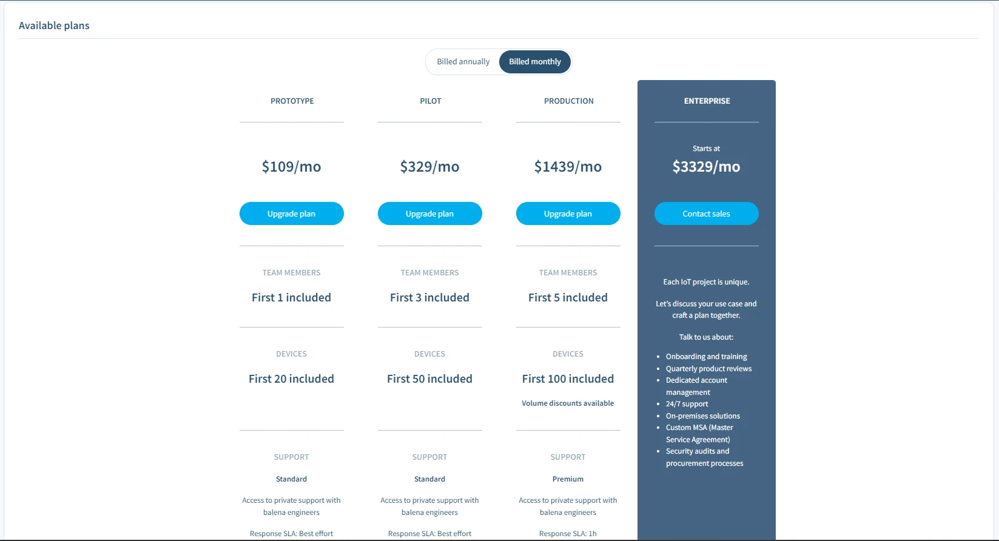
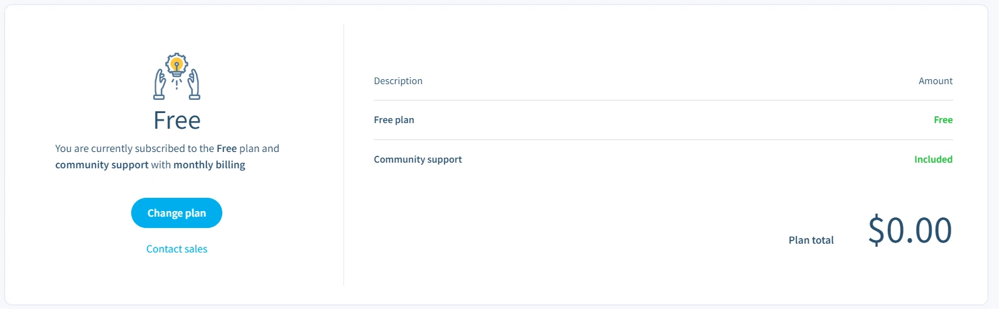
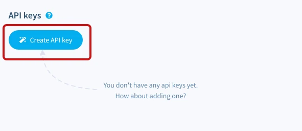

# Contributing

Thank you for contributing to the docs! We have a few guidelines which will allow your PR to pass our CI checks and successfully merge.

### Creating Commits using the GitHub UI

For folks using the Github UI to create new pull requests, check out the following guides in order to get started.

1. [Editing files and proposing changes](https://docs.github.com/en/github/managing-files-in-a-repository/editing-files-in-your-repository) on a GitHub Repository.


2. When the changes have been committed, [create a pull request for the proposed changes](https://docs.github.com/en/github/collaborating-with-issues-and-pull-requests/creating-a-pull-request#creating-the-pull-request) through the GitHub UI.

## Adding images/screenshots to the docs

> Choose whichever format that suits your need

Images and screenshots help the user in better understanding of the docs. Before adding a screenshot, make sure to keep the area in focus, text is clearly visible and doesn't have any identifying information. Rename the screenshot appropriately and make sure to upload them to the right path.



Do mark the menu options, buttons or tabs with a red box as and when needed.



Images for the documentation are stored in the [/pages/.gitbook/assets/](https://github.com/balena-io/docs/tree/main/pages/.gitbook/assets) directory.

To add an image to the documentation,

1. Upload/add the image(s) to the [/pages/.gitbook/assets/](https://github.com/balena-io/docs/tree/main/pages/.gitbook/assets) directory. One can also use the GitHub UI to [upload files](https://docs.github.com/en/github/managing-files-in-a-repository/adding-a-file-to-a-repository).
2. Images need to be uploaded in `PNG`, `JPEG`, `SVG`, or `WEBP` format to render correctly in markdown. It is preferable to use the `WEBP` format in order to optimize the docs loading experience.
3. After adding, refer and add them to the relevant documentation page as shown in the example below:

```html
<figure>
	
	<figcaption></figcaption>
</figure>
```

## Adding links to the docs

Use the following format for external links: `[I'm an inline-style link](https://docs.balena.io)`.

For internal links (referencing our own documentation), use the following format instead: `[basic requirements](../../reference/os/network.md#network-requirements)`. The path is relative, and must be calculated from the page's location in SUMMARY.md, not its location on disk. These can differ for external docs. To determine the correct path:

1. Find where the page sits in `SUMMARY.md`. GitBook uses `SUMMARY.md` to determine a page's URL, based on its nesting. For example, `external-docs/update-locking.md` lives on disk in `/pages/external-docs/`, but in `SUMMARY.md` it's nested under `learn/deploy/release-strategy/`. GitBook treats the page as if it were at `/learn/deploy/release-strategy/update-locking`.
2. Build the relative link from that logical location. So if you're editing `update-locking.md` and want to link to `reference/os/network.md`, you'd calculate the path from `learn/deploy/release-strategy/`, not from `external-docs/` — giving you something like `../../../reference/os/network.md`.

## Contributing to External Documentation

Some reference documentation is sourced from external repositories and should be updated at the source. External docs are version-pinned in [`external-docs.json`](external-docs.json) and synced via Renovate.

To add additional external documentation:

1. Add an entry to [`external-docs.json`](external-docs.json) with the repo, pinned version tag, and file mappings.
   1. If the doc will be **its own page**, set the target directory somewhere under `/pages` (but not under `/pages/.gitbook`).
   2. If the doc will be **embedded in another page**, set the target directory to `/pages/.gitbook/includes` so it can be used as reusable content.
2. Run `npm run sync-external` to fetch the content.
3. If the external doc is its own page, add an entry to [`pages/SUMMARY.md`](pages/SUMMARY.md) so the page appears in the navigation.

Renovate will automatically detect version updates and create PRs with the synced content.

## Best Practices to follow

Be sure to familiarize yourself with the style manual and conventions to be followed while contributing to balenaCloud documentation. This helps in maintaining consistency of the documentation already written by other contributors. These best practices also help avoid common mistakes and make sure one is using templates & partials the right way.

- How to write [balena-specific words](README.md#balena-specific-words)
- Using [Reusable Content](README.md#using-reusable-content) and [Templates](README.md#using-templates)
