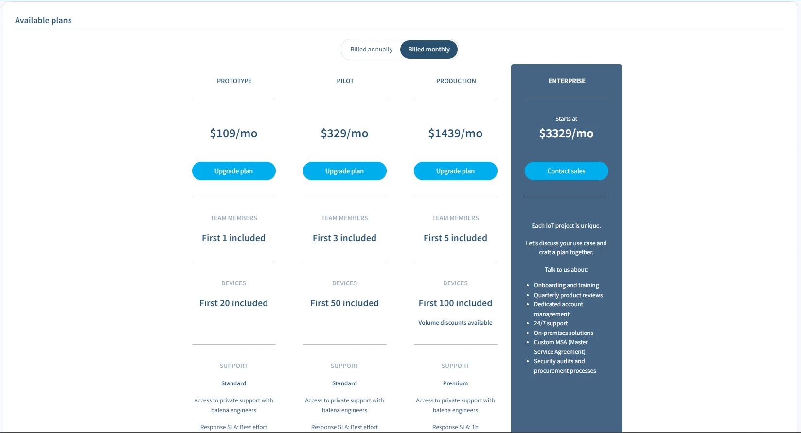

# Contributing

Thank you for contributing to the docs! We have a few guidelines which will allow your PR to pass our CI checks and successfully merge.

## Creating Commits in line with Semantic Versioning

> **TL:DR** The docs version numbering adheres to [Semantic Versioning](https://semver.org/). **Please include *at least one commit* in the PR that marks the change-type for the system.** 

This change-type can be specified by adding it as a prefix, i.e., `minor: Add some new feature` while creating the commit. This is so the PR can be automatically versioned and a changelog generated for it by using versionist. One can choose one of 3 `Change-type` options on the nature of the file change. 

- `patch` - For tiny changes that include typo fixes, updating screenshots, adding clarification notes, etc.
- `minor` - For moderate changes that include updating packages, rewriting documentation, adding new features.
- `major`- For substantial changes that include updating large parts of the documentation or migrating to new frameworks. 

### Creating Commits using the GitHub UI

For folks using the Github UI to create new pull requests, check out the following guides in order to get started. 

1. [Editing files and proposing changes](https://docs.github.com/en/github/managing-files-in-a-repository/editing-files-in-your-repository) on a GitHub Repository. When committing changes, here's how one can add a `Change-type` as a prefix to the commit. Adding `patch:` before the commit will mark the change-type as `patch` successfully. 


2. When the changes have been committed, [create a pull request for the proposed changes](https://docs.github.com/en/github/collaborating-with-issues-and-pull-requests/creating-a-pull-request#creating-the-pull-request) through the GitHub UI. 

### Using the Command-Line

For folks experienced with the git command-line, when creating a commit, make sure to add the `Change-type` prefix to a commit using the following command.

```bash
git commit -m "patch: Update v8 configuration for contracts"
```

This will allow the system to version the documentation using the `Change-type` automatically. The versioning follows [semver](https://semver.org/), and changes can be of type `patch`, `minor` or `major`. Adding it as a pull request message doesn't work. Without the prefix in place, the CI checks will fail. **Again, please make sure to include *at least one commit* in the PR that marks the change-type for the system.** 

## Adding images/screenshots to the docs

> Choose whichever format that suits your need

Images and screenshots help the user in better understanding of the docs. Before adding a screenshot, make sure to keep the area in focus, text is clearly visible and doesn't have any identifying information. Rename the screenshot appropriately and make sure to upload them to the right path.



Do mark the menu options, buttons or tabs with a red box as and when needed.


Images for the documentation are stored in [static/img](https://github.com/balena-io/docs/tree/master/static/img) directory. Screenshots of the dashboard are commonly stored in the [common](https://github.com/balena-io/docs/tree/master/static/img/common) directory.  

To add an image to the documentation,

1. Upload/add the image(s) to one of the folder inside the [static/img](https://github.com/balena-io/docs/tree/master/static/img) directory. One can also use the GitHub UI to [upload files](https://docs.github.com/en/github/managing-files-in-a-repository/adding-a-file-to-a-repository). 
2. Images need to be uploaded in `PNG`, `JPEG`, or `SVG` format to render correctly in markdown. 
3. When added, refer and add them to the relevant documentation page using either the markdown format.

```markdown

```

OR use the HTML `` tag

```html

```

## Adding links to the docs

> Choose whichever format that suits your need

To add links in markdown, use the format `[I'm an inline-style link](https://docs.balena.io)` which results in [I'm an inline-style link](https://docs.balena.io)

OR using `[I'm a reference-style link][reference text]` which results in [I'm a reference-style link][reference text] where `reference text` is referred at the bottom of the markdown file. These link types can be used multiple times in the same document.

More examples are given below, 

```
[multicontainer]:/learn/develop/multicontainer
[poll-interval]: /learn/manage/configuration/#variable-list
[multicontainer-project]:https://github.com/balenalabs/multicontainer-getting-started/tree/master/haproxy
```

Check the [links module](https://github.com/balena-io/docs/blob/master/config/links.coffee) to find link references that are being used all across the documentation and to add new ones as needed. 

## Contributing to External Documentation

It is worth noting that some of the reference documentation is sourced from the individual component repositories and should be updated at the source. 
To add additional external documentation, follow these steps:

1. Update [`tools/fetch-external.sh`](https://github.com/balena-io/docs/blob/master/tools/fetch-external.sh) to add the additional external source. If required, rename the source document as this will be used in the docs URL. This dynamically determining the `Improve this Doc` link and has to be unique. 
2. Update `externalDocs` in [`config/links.coffee`](https://github.com/balena-io/docs/blob/master/config/links.coffee) to add the link to edit the source file. This is the link presented in `Improve this Doc`. The key must match the name of the filename without the .md extension. Example, for a file named `node-sdk.md`, the key must be added like `"node-sdk": 'https://github.com/balena-io/balena-sdk/edit/master/DOCUMENTATION.md'`.
3. In [`config/index.coffee`](https://github.com/balena-io/docs/blob/master/config/index.coffee) add the filename (again without the .md extension) to the `EXTERNAL_DOCS` variable so that the system knows to identify this file as coming from an external source correctly.
4. If the source is currently duplicated in this repo, then delete the content from this repo and add the files to `/.gitignore`.

If a page is removed that may be linked externally to some other docs, do remember to add it to the `redirects.txt` in the root of the docs. If one doesn’t, then links will break, and folks will have an awful time.

Currently, the following reference material is pulled from other repositories:
- [Device Supervisor API](https://www.balena.io/docs/reference/supervisor/supervisor-api/) and [Device Supervisor upgrades](https://www.balena.io/docs/reference/supervisor/supervisor-upgrades), sourced from https://github.com/balena-io/balena-supervisor/tree/master/docs
- [CLI](https://docs.balena.io/reference/cli/) sourced from https://github.com/balena-io/balena-cli/blob/master/doc/cli.markdown
- [Node SDK](https://docs.balena.io/reference/sdk/node-sdk/) sourced from https://github.com/balena-io/balena-sdk/blob/master/DOCUMENTATION.md
- [Python SDK](https://docs.balena.io/reference/sdk/python-sdk/) sourced from https://github.com/balena-io/balena-sdk-python/blob/master/DOCUMENTATION.md

And more. The updated list of external resources can be found in [tools/fetch-external.sh](https://github.com/balena-io/docs/blob/master/tools/fetch-external.sh)  

## Version numbers & Changelogs

Version numbers and commit messages are automatically added to the [`CHANGELOG.md`](CHANGELOG.md) file by the CI build flow after a pull request is merged. It should not be manually edited.

## Best Practices to follow

Be sure to familiarize yourself with the style manual and conventions to be followed while contributing to balenaCloud documentation. This helps in maintaining consistency of the documentation already written by other contributors. These best practices also help avoid common mistakes and make sure one is using templates & partials the right way.

- How to write [balena-specific words](README.md#balena-specific-words)
- [Conventions & Best Practices](README.md#conventions--best-practices)
- Using [Partials](README.md#using-partials) and [Templates](README.md#using-templates)


[reference text]: https://balena.io
