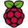

|                                     Logo                                    | Device Name                       | Machine Name           | Architecture |                                                                      |
| :-------------------------------------------------------------------------: | --------------------------------- | ---------------------- | ------------ | -------------------------------------------------------------------- |
|        | BeagleBone Black                  | beaglebone-black       | armv7hf      | [Get started](../../learn/getting-started/beaglebone-black.md)       |
|         | Generic AARCH64                   | generic-aarch64        | aarch64      | [Get started](../../learn/getting-started/generic-aarch64.md)        |
|           | Generic x86\_64 (GPT)             | generic-amd64          | amd64        | [Get started](../../learn/getting-started/generic-amd64.md)          |
|       | Generic x86\_64 (legacy MBR)      | genericx86-64-ext      | amd64        | [Get started](../../learn/getting-started/genericx86-64-ext.md)      |
|               | Intel NUC                         | intel-nuc              | amd64        | [Get started](../../learn/getting-started/intel-nuc.md)              |
|             | Nitrogen8M Mini SBC               | nitrogen8mm            | aarch64      | [Get started](../../learn/getting-started/nitrogen8mm.md)            |
|              | Nvidia Jetson TX2                 | jetson-tx2             | aarch64      | [Get started](../../learn/getting-started/jetson-tx2.md)             |
|            | Raspberry Pi 3                    | raspberrypi3           | armv7hf      | [Get started](../../learn/getting-started/raspberrypi3.md)           |
|         | Raspberry Pi 3 (using 64bit OS)   | raspberrypi3-64        | aarch64      | [Get started](../../learn/getting-started/raspberrypi3-64.md)        |
|         | Raspberry Pi 4 (using 64bit OS)   | raspberrypi4-64        | aarch64      | [Get started](../../learn/getting-started/raspberrypi4-64.md)        |
|            | Raspberry Pi 5                    | raspberrypi5           | aarch64      | [Get started](../../learn/getting-started/raspberrypi5.md)           |
|  | Raspberry Pi CM4 IO Board         | raspberrypicm4-ioboard | aarch64      | [Get started](../../learn/getting-started/raspberrypicm4-ioboard.md) |
|            | Raspberry Pi (v1 / Zero / Zero W) | raspberry-pi           | rpi          | [Get started](../../learn/getting-started/raspberry-pi.md)           |
|           | Revolution Pi Connect             | revpi-connect          | armv7hf      | [Get started](../../learn/getting-started/revpi-connect.md)          |
|        | ROCK Pi 4B                        | rockpi-4b-rk3399       | aarch64      | [Get started](../../learn/getting-started/rockpi-4b-rk3399.md)       |
|                | UP Board                          | up-board               | amd64        | [Get started](../../learn/getting-started/up-board.md)               |
|         | Variscite DART-6UL                | imx6ul-var-dart        | armv7hf      | [Get started](../../learn/getting-started/imx6ul-var-dart.md)        |
