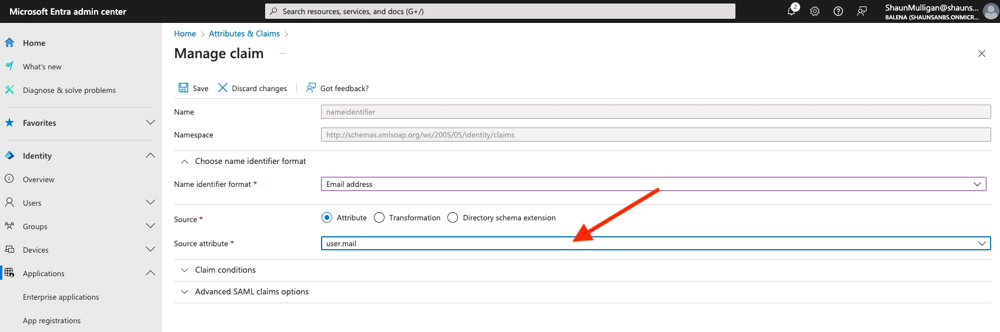

# Configure a SAML app for Microsoft Entra ID (formerly Azure Active Directory)

This section provides step-by-step instructions for setting up SAML 2.0 with Microsoft Entra ID (formerly Azure AD) for use with balenaCloud. Follow the steps below and refer to the accompanying screenshots for visual guidance. At the end of this guide, you can start using Single Sign-On functionality from your IdP in balenaCloud.

## Create a New Enterprise Application

1. Go to: [Microsoft Entra ID Home](https://entra.microsoft.com/#home).
2. On the left hand menu expand `Identity > Applications > Enterprise Applications`.
3. Select Enterprise Applications.
4. Click the `+ New application` button.

<figure><figcaption></figcaption></figure>

## Create Your Own Application

1. You should now be presented with a gallery of enterprise apps. Click the `+ Create your own application button` at the top left.
2. In the right-hand form that opens, give your app a name.
3. Leave the default option selected.
4. Click `Create`.

<figure><figcaption></figcaption></figure>

## Configure Single Sign-On

1. In the left menu, click Single sign-on.
2. Select SAML.

<figure><figcaption></figcaption></figure>

## Basic SAML Configuration

1. In the Basic SAML Configuration section, click `Edit`.
2. Paste your Entity ID and Sign-on URL. To obtain this, you must first decide on a “SSO Identifier” for your enterprise, e.g. `acme`.

* Identifier: https://api.balena-cloud.com/auth/saml/`< sso-identifier >`
* Reply URL: https://api.balena-cloud.com/auth/saml/`< sso-identifier >`/callback

3. Click Save.

<figure><figcaption></figcaption></figure>

#### Set Unique User Identifier

1. On the “Set up Single Sign-On with SAML” page, click `Edit` on the Attributes & Claims section.
2. On the Unique User Identifier row, click it.
3. Change the Source attribute field to `user.mail`.
4. Click Save.

<figure><figcaption></figcaption></figure>

<figure><figcaption></figcaption></figure>

#### Assign Users and Groups

1. Go to Users & Groups in the Manage section of the SAML app.
2. Add the users or groups you want to assign access to the SAML app.
3. Click Assign at the bottom left.

<figure><figcaption></figcaption></figure>

#### Download Federation Metadata XML

1. On your SAML-based Sign-on app page, look for the Download link for Federation Metadata XML.
2. Download this XML file to use later in [setting up your SAML IdP in balenaCloud](../#link-a-saml-identity-provider).

<figure><figcaption></figcaption></figure>

Congratulations! You should now have your Identity Provider (IdP) setup, head over to the balenaCloud dashboard and follow the [instructions to link an IdP](../#link-a-saml-identity-provider) by uploading the XML metadata file. Your team can then start using the Single Sign-On (SSO) functionality, allowing them to securely and seamlessly access the platform using their enterprise credentials.
