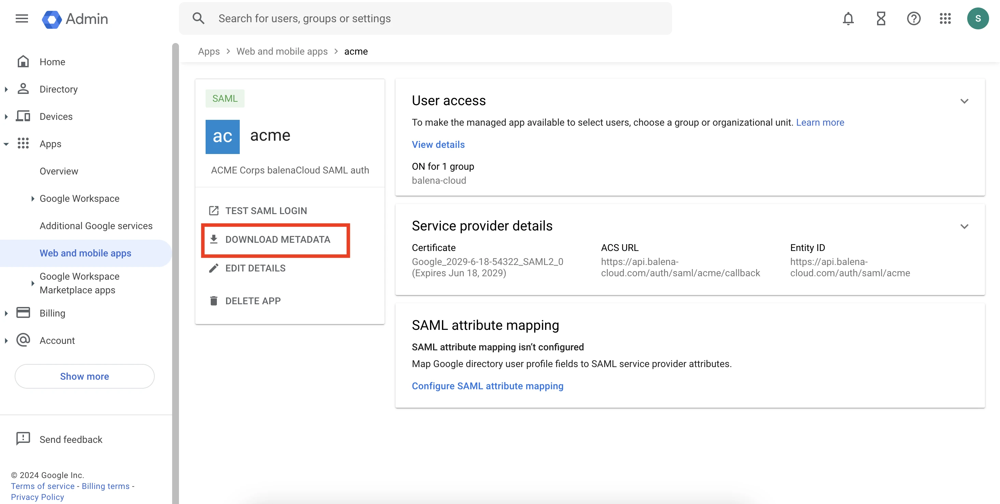

# Configure a SAML app for Google Workspace

This guide will walk you through the steps to create a SAML Identity Provider (IdP) using Google Workspace to integrate with balenaCloud. At the end of this guide, you can start using Single Sign-On functionality from your IdP in balenaCloud.

## Prerequisites

1. Access to a Google Workspace admin account capable of creating apps and users for the organization.

## Steps

1. Access the Google Admin Console
   * Go to [Google Admin Console Apps](https://admin.google.com/ac/apps/unified) using your Google Workspace admin account.
2. Create a New Custom SAML App
   * Click on Add app.
   * Select Add custom SAML app.
3. Configure the SAML App
   * Name Your App: Provide a meaningful name for the SAML app (e.g., “balenaCloud SSO”).
   * Download the Metadata: After naming your app, download the metadata file provided by Google. This file will be used later to set up the IdP in balenaCloud.
4.  Set Up Service Provider Details

    * ACS URL: Fill in the Assertion Consumer Service (ACS) URL with:

    ```
    https://api.balena-cloud.com/auth/saml/acme/callback
    ```

    Replace `acme` with the name you will give your IdP in balenaCloud.

    * Entity ID: Fill in the Entity ID with:

    ```
    https://api.balena-cloud.com/auth/saml/acme
    ```

    Again, replace `acme` with the name you will give your IdP.
5. Skip Attribute Mapping
   * Ignore any mapping configuration. Currently, balenaCloud does not make use of these mappings.
6. Enable the SAML App
   * In the Service Status section, ensure the new SAML app is set to `ON` for everyone or specific groups. This will those users in your organization access to login to balenaCloud via SSO.
7. Finally, you should a custom SAML app in your Google Workspace that looks similar to this

<figure><figcaption></figcaption></figure>

## Conclusion

Congratulations! You should now have your Identity Provider (IdP) setup, head over to the balenaCloud dashboard and follow the [instructions to link an IdP](../../../../learn/accounts/enterprise-sso/#link-a-saml-identity-provider) by uploading the XML metadata file. Your team can then start using the Single Sign-On (SSO) functionality, allowing them to securely and seamlessly access the platform using their enterprise credentials.
