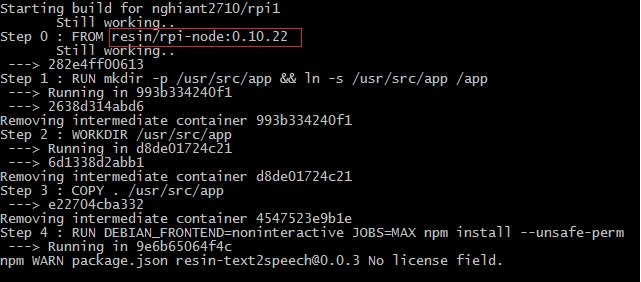

# Define a container

Balena uses [Docker](https://www.docker.com/) containers to manage deployment and updates. You can use one or more containers to package your services with whichever environments and tools they need to run.

To ensure a service has everything it needs, you'll want to create a list of instructions for building a [container image](https://docs.docker.com/engine/understanding-docker/#/inside-docker). Whether the build process is done [on your device](local-mode.md), [on your workstation](../../../external-docs/balena-cli/latest.md#build), or on the [balena builders](../deploy/deployment.md), the end result is a read-only image that ends up on your device. This image is used by the container engine (balena or Docker, depending on the balenaOS version) to kick off a running container.


For additional information on working with Dockerfiles with balena see the [services masterclass](../../../external-docs/masterclasses/services-masterclass.md).


## Dockerfiles

The instructions for building a container image are written in a [Dockerfile](https://docs.docker.com/engine/reference/builder/) - this is similar to a `Makefile` in that it contains a recipe or set of instructions to build our container.

The syntax of Dockerfiles is fairly simple - at core there are 2 valid entries in a Dockerfile - comments, prepended with `#` as in script files, and instructions of the format `INSTRUCTION arguments`.

Typically you will only need to use 4 instructions - [FROM](https://docs.docker.com/engine/reference/builder/#from), [RUN](https://docs.docker.com/engine/reference/builder/#run) and [ADD](https://docs.docker.com/engine/reference/builder/#add) or [COPY](https://docs.docker.com/engine/reference/builder/#copy):-

* [FROM](https://docs.docker.com/engine/reference/builder/#from) **has** to be the first instruction in any valid `Dockerfile` and defines the base image to use as the basis for the container you're building.
* [RUN](https://docs.docker.com/engine/reference/builder/#run) simply executes commands in the container - this can be of the format of a single line to execute, e.g. `RUN apt-get -y update` which will be run via `/bin/sh -c`, or `[ "executable", "param1", "param2", ... ]` which is executed directly.
* [ADD](https://docs.docker.com/engine/reference/builder/#add) copies files from the current directory into the container, e.g. `ADD <src> <dest>`. Note that if `<dest>` doesn't exist, it will be created for you, e.g. if you specify a folder. If the `<src>` is a _local_ tar archive it will unpack it for you. It also allows the `<src>` to be a url but will **not** unpack _remote_ urls.
* [COPY](https://docs.docker.com/engine/reference/builder/#copy) is very similar to [ADD](https://docs.docker.com/engine/reference/builder/#add), but without the compression and url functionality. According to [the Dockerfile best practices](https://docs.docker.com/develop/develop-images/dockerfile_best-practices/#add-or-copy), you should always use [COPY](https://docs.docker.com/engine/reference/builder/#copy) unless the auto-extraction capability of [ADD](https://docs.docker.com/engine/reference/builder/#add) is needed.
* [CMD](https://docs.docker.com/engine/reference/builder/#cmd) this command provides defaults for an executing container. This command will be run when the container starts up on your device, whereas RUN commands will be executed on our build servers. In a balena service, this is typically used to execute a start script or entrypoint for the user's service. [CMD](https://docs.docker.com/engine/reference/builder/#cmd) should always be the last command in your Dockerfile. The only processes that will run inside the container are the [CMD](https://docs.docker.com/engine/reference/builder/#cmd) command and all processes that it spawns.

For details on other instructions, consult the official [Dockerfile documentation](https://docs.docker.com/engine/reference/builder/).

### Using Dockerfiles with balena

To deploy a single-container release to balena, simply place a `Dockerfile` at the root of your repository. A `docker-compose.yml` file will be automatically generated, ensuring your container has host networking, is privileged, and has `lib/modules`, `/lib/firmware`, and `/run/dbus` bind mounted into the container. The default `docker-compose.yml` will look something like this:



```yaml
version: '2.1'
networks: {}
volumes:
  resin-data: {}
services:
  main:
    build:
      context: .
    privileged: true
    restart: always
    network_mode: host
    volumes:
      - 'resin-data:/data'
    labels:
      io.balena.features.kernel-modules: '1'
      io.balena.features.firmware: '1'
      io.balena.features.dbus: '1'
      io.balena.features.supervisor-api: '1'
      io.balena.features.balena-api: '1'
```

Releases with multiple services should include a `Dockerfile` or `package.json` in each service directory. A `docker-compose.yml` file will need to be defined at the root of the repository, as discussed in our [multicontainer documentation](multicontainer.md).

You can also include a `.dockerignore` file with your project if you wish the builder to ignore certain files.


You _don't_ need to worry about ignoring `.git` as the builders already do this by default.


## Dockerfile templates

Dockerfile templates are a balena-specific feature that allow our builders to substitute a value for one of the following variables at build time:



The original purpose of these templates was to allow our builders to build containers for multiple architectures from one code repository when using the deprecated balenalib base images. For new projects, we recommend using standard Dockerfiles and either specifying the architecture in your FROM line, or utilizing base images that are published with the [multi-platform feature](https://docs.docker.com/build/building/multi-platform/). For example:

`FROM bh.cr/balenalabs/browser-aarch64`

Here, we are pulling an ARMv8 (aarch64) architecture-specific container image. This image can only be used for fleets with devices of that architecture.

`FROM debian:trixie`

This Debian Official Docker image is a multi-arch image instead. Upon build time, the balena builders would pull the correct architecture of the image based on the default device type of your fleet. This reduces complexity and provides a similar feature set to Dockerfile templates in the past.

It is possible to have different device types in the same fleet, as long as they have the same or compatible architectures. You need to ensure that your packages and modules are also available in that target architecture, otherwise, your application might throw errors or fail during runtime.

If you are still using balenalib base images for an existing project, you can use dockerfile templates as described below:

```dockerfile
FROM {{ $names.base_images.lib }}/%%BALENA_MACHINE_NAME%%-node

COPY package.json /package.json
RUN npm install

COPY src/ /usr/src/app
CMD ["node", "/usr/src/app/main.js"]
```

This `dockerfile.template` file will build and deploy a Node.js project for any of the devices supported by balena, regardless of device architecture, whether is [ARM](https://en.wikipedia.org/wiki/ARM_architecture) or [x86](https://en.wikipedia.org/wiki/X86).

In this example, the build variable `%%BALENA_MACHINE_NAME%%`. This will be replaced by the machine name (i.e.: `raspberry-pi`) at build time. Refer to [supported machine names and architectures](../../reference/hardware/devices.md).

The machine name is inferred from the device type of the fleet you are deploying on. So if you have a NanoPi Neo Air fleet, the machine name will be `nanopi-neo-air` and an `armv7hf` architecture base image will be built.


If your fleet contains devices of different types, the `%%BALENA_MACHINE_NAME%%` build variable **will not** evaluate correctly for all devices. Your fleet services are built once for all devices, and the `%%BALENA_MACHINE_NAME%%` variable will pull from the device type associated with the fleet, rather than the target device. In this scenario, you can use `%%BALENA_ARCH%%` to pull a base image that matches the shared architecture of the devices in your fleet.


If you want to see an example of build variables in action, have a look at this [basic openssh example](https://github.com/balena-io-playground/balena-openssh).

## Multiple Dockerfiles

There are cases when you would need a higher granularity of control when specifying build instructions for different devices and architectures than a single Dockerfile template can provide. An example of this would be when different configuration or installation files are required for each architecture or device.

When creating a release, the balenaCloud build servers or the balena CLI tool (depending on the deployment method used) look at all available Dockerfiles and build the appropriate image using the following order of preference:

* Dockerfile.\<device-type>
* Dockerfile.\<arch>
* Dockerfile.template

As an example, let's say you have two Dockerfiles available, `Dockerfile.raspberrypi3` and `Dockerfile.template`. Whenever you publish the application to balenaCloud, if the fleet `device-type` is Raspberry Pi 3, `Dockerfile.raspberrypi3` will be selected as an exact match and for all other devices the builder will automatically select `Dockerfile.template`.

Note that this feature works with the following commands: `git push`, `balena push`, `balena build`, and `balena deploy`.

## Node applications

Balena supports [Node.js](https://node.jshttps/nodejs.org/) natively using the [package.json](https://docs.npmjs.com/files/package.json) file located in the root of the repository to determine how to build and execute node applications.

When you push your code to your fleet, the build server generates a [container](https://en.wikipedia.org/wiki/Operating_system%E2%80%93level_virtualization) for the environment your device operates in, deploys your code to it and runs `npm install` to resolve [npm](https://www.npmjs.org/) dependencies, reporting progress to your terminal as it goes.

If the build executes successfully the release is deployed to your device where the supervisor runs it in place of any previously running containers, using `npm start` to execute your code (note that if no start script is specified, it defaults to running `node server.js`.)

### Node.js Example

A good example of this is the [text-to-speech](https://github.com/balena-io/text2speech) application - here's its `package.json` file\*:

```json
{
	"name": "text2speech",
	"description": "Simple balena app that uses Google's TTS endpoint",
	"repository": {
		"type": "git",
		"url": "https://github.com/balena-io/text2speech.git"
	},
	"scripts": {
		"preinstall": "bash deps.sh"
	},
	"version": "0.0.3",
	"dependencies": {
		"speaker": "~0.0.10",
		"request": "~2.22.0",
		"lame": "~1.0.2"
	},
	"engines": {
		"node": "0.10.22"
	}
}
```


We don't specify a `start` script here which means node will default to running `server.js`. We execute a bash script called `deps.sh` before `npm install` tries to satisfy the code's dependencies. Let's have a look at that:-


```shell
apt-get install -y alsa-utils libasound2-dev
mv sound_start /usr/bin/sound_start
```

These are shell commands that are run within the container on the build server which are configured such that dependencies are resolved for the target architecture not the build server's - this can be very useful for deploying non-javascript code or fulfilling package dependencies that your node code might require.

We use [Raspbian](https://www.raspbian.org/) as our contained operating system, so this script uses [aptitude](https://wiki.debian.org/Aptitude) to install native packages before moving a script for our node code to use over to `/usr/bin` (the install scripts runs with root privileges within the container.)


With a plain Node.js project, our build server will detect compatible nodejs versions from the `package.json` and build the container using a Docker image that satisfies the version requirement. If no version is specified then the default node version is `0.10.22` and it will be used if a node version is not specified. There will be an error if the specified node version is not in our registry. You can either try another node version or contact us to be supported. More details about Docker node images in our registry can be found [here](../../reference/base-images/balena-base-images.md).


<figure><figcaption></figcaption></figure>

## Container Requirements

The balena Supervisor requires that the directory `/tmp/balena` in containers be available for inter-container communication via [update locks](../../../external-docs/update-locking.md). Therefore, scripts should not attempt to remove this directory on startup.
