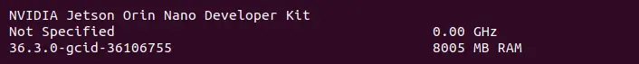

# Nvidia Jetson AGX Orin Devkit 32GB

<figure><figcaption></figcaption></figure>

The Nvidia Jetson AGX Orin 32GB development kit can be identified by the label printed on the inside bottom of the unit as shown. It mentions part number 975-13730-0000-000 but does not actually say 32GB.

<figure><figcaption></figcaption></figure>

<figure><figcaption></figcaption></figure>

This device exposes a debug UART interface over the microUSB port. From Linux machines, the serial connection can be accessed using `minicom -D /dev/ttyACM0`. It also offers one Display Port for video output.

The default internal storage used for provisioning balenaOS is the AGX Orin 32GB's on-board eMMC, and the [Jetson Flash](https://github.com/balena-os/jetson-flash) tool is used for provisioning balenaOS. The eMMC is the only boot medium supported for this device type currently.

#### **Checking your Jetson Orin's UEFI firmware version**

You can check which UEFI firmware version your Jetson Orin device is running either by connecting to your device's debug UART interface, or by attaching a display to the Orin's video port.

I want to use the debug UART interface

The debug UART interface of the Jetson AGX Orin 32GB Devkit is available through the micro-USB interface, when the device is powered on. Connect the other end of the micro-usb cable to your host/development PC. If your host is running Linux, the serial connection to the Jetson device can be accessed using `minicom -D /dev/ttyACM0`.

<figure><figcaption></figcaption></figure>

If you are using the UART interface, the UEFI firmware version will be printed in the boot sequence logs:

<figure><figcaption></figcaption></figure>

Alternatively, if booting is stopped in the UEFI menu by pressing `Esc`, the firmware version will be printed in the top-left corner:

<figure><figcaption></figcaption></figure>

If instead you would like to use a monitor and a keyboard, please expand the section below.

I want to use a monitor

A Display Port cable or Display Port to HDMI adapter is necessary for connecting your Jetson AGX Orin Devkit 32GB to a monitor. Once the monitor is attached, the UEFI firmware version will be displayed at the top of the screen:

<figure><figcaption></figcaption></figure>

If you want to see options for other Orin devices, select the device from the drop down at the top of this page.
