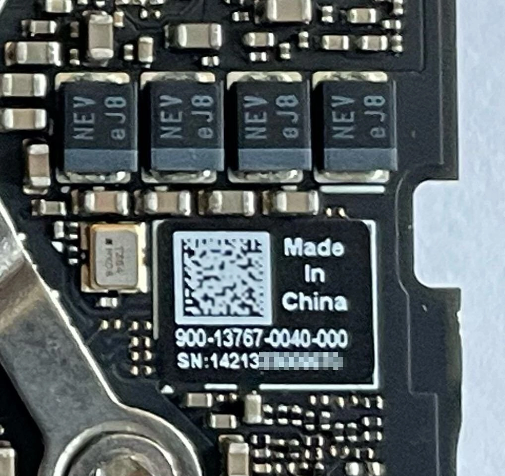
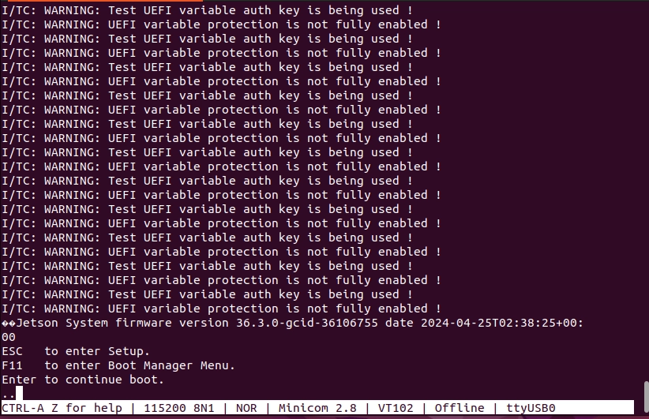

# Seeed reComputer J3010 Jetson Orin Nano 4GB

The device has the Seeed Studio logo on the back, and the following sticker on the bottom:

<figure><figcaption></figcaption></figure>

The SOM in the Seeed reComputer J3010 is a Jetson Orin Nano 4GB, which has the part number 900-13767-0040-000. This part number can be found on the bottom of the SOM, if it is taken out of the carrier board:

<figure><figcaption></figcaption></figure>

<figure><figcaption></figcaption></figure>

The J401 carrier board included in the full reComputer J3010 system exposes a debug interface on the UART TXD, UART RXD and GND pins, which are located underneath the Orin Nano SOM. Additionally, a monitor can be connected to the board's HDMI Port.

The default internal storage used for provisioning balenaOS on the Seeed reComputer J3010 Jetson Orin Nano 4GB is an NVME drive, which needs to be attached to the carrier board prior to booting via a USB flash drive containing the balenaOS flasher image. If instead you would like to use other media, like for example an SSD as main storage, please consult the OS installer target\_devices configuration option or the [alternative provisioning options](jetson-orin-nano-seeed-j3010.md#alternative-provisioning-options) section below.

#### **Checking your Jetson Orin's UEFI firmware version**

You can check which UEFI firmware version your Jetson Orin device is running either by connecting to your device's debug UART interface, or by attaching a display to the Orin's video port.

<details>

<summary>I want to use the debug UART interface</summary>

For this step you will need a USB to TTL converter cable. The USB to TTL converter's pins need to be connected to the UART TXD, UART RXD and GND pins on the Jetson carrier board, which are located underneath the Orin module. The other end of the cable should be plugged into the USB port of your host/development PC. Your host PC can connect to the Jetson device using a serial communication program like `minicom`

<figure><figcaption></figcaption></figure>

<figure><figcaption></figcaption></figure>

If you are using the UART interface, the UEFI firmware version will be printed in the boot sequence logs:

<figure><figcaption></figcaption></figure>

Alternatively, if booting is stopped in the UEFI menu by pressing `Esc`, the firmware version will be printed in the top-left corner:

<figure><figcaption></figcaption></figure>

If instead you would like to use a monitor and a keyboard, please expand the section below.

</details>

<details>

<summary>I want to use a monitor</summary>

**An HDMI cable is necessary for connecting your Seed reComputer J3010 to a monitor.** Once the monitor is attached, the UEFI firmware version will be displayed at the top of the screen:

<figure><figcaption></figcaption></figure>

</details>

\
In case the UEFI firmware version on your device is older than v36.3.0, please update its firmware using the following guide:

* [Flashing Jetpack 6 using SDK Manager](https://developer.ridgerun.com/wiki/index.php/JetPack_6_Migration_and_Developer_Guide/Installing_JetPack_6/Flashing_with_SDK_Manager) 🔗

If for whatever reason checking the UEFI firmware version is not possible, flashing Jetpack 6 using the SDK Manager will guarantee your device has the latest firmware installed.

Once your device's UEFI firmware is v36.3.0 or newer, you can use a USB flash drive to provision it directly with balenaOS.

#### **Booting balenaOS flasher images from a USB flash drive**

If the firmware on your device is v36.3.0 or newer, inserting the USB flash drive with the balenaOS flasher image and connecting power to your device will provision the internal storage. In the unexpected event that your device does not boot the balenaOS flasher image from the attached USB flash drive automatically, use the following steps to manually select the USB flash drive for booting:

<details>

<summary>I want to use the debug UART interface</summary>

1. For this step you will need a USB to TTL converter cable. The USB to TTL converter's pins need to be connected to the UART TXD, UART RXD and GND pins on the Jetson carrier board, which are located underneath the Orin module. The other end of the cable should be plugged into the USB port of your host/development PC. Your host PC can connect to the Jetson device using a serial communication program like `minicom`

<figure><figcaption></figcaption></figure>

<figure><figcaption></figcaption></figure>

2. Power on the device and press `Esc` when prompted by the UEFI firmware, or `F11` to enter the Boot Manager Menu directly:

<figure><figcaption></figcaption></figure>

If `Esc` was pressed, navigate to the Boot Manager Menu:

<figure><figcaption></figcaption></figure>

3. Select the attached USB device as boot media:

<figure><figcaption></figcaption></figure>

4. Your device should boot from the attached USB flash drive and provision the internal storage. Once provisioning is complete and the device shuts down, the USB flash drive can be unplugged.
5. Remove and re-connect power to the carrier board.
6. Your device should appear in your application dashboard within a few minutes.

Should you encounter any unexpected issues while provisioning your device, please follow the instructions for our [Jetson Flash](https://github.com/balena-os/jetson-flash) tool to flash your device in recovery boot mode.

If instead you would like to use a monitor and a keyboard, please expand the section below.

</details>

<details>

<summary>I want to use a keyboard and monitor</summary>

**An HDMI cable is necessary for connecting your Seeed reComputer to a monitor.**

1. Attach a USB keyboard and a monitor to the device.
2. Power on the device and press `Esc` when prompted by the UEFI firmware, or `F11` to enter the Boot Manager Menu directly:

<figure><figcaption></figcaption></figure>

<figure><figcaption></figcaption></figure>

3. Select the attached USB flash drive as boot media:

<figure><figcaption></figcaption></figure>

4. Your device should boot from the attached USB flash drive and provision the internal storage. Once provisioning is complete and the device shuts down, the USB flash drive can be unplugged.
5. Remove and re-connect power to the carrier board.
6. Your device should appear in your application dashboard within a few minutes.

Should you encounter any unexpected issues while provisioning your device, please follow the instructions for our [Jetson Flash](https://github.com/balena-os/jetson-flash) tool to flash your device in recovery boot mode.

</details>

#### **Post-provisioning UEFI firmware update**

Once your device has been provisioned with balenaOS and powered back-on, it will attempt to update the UEFI firmware automatically. The status of the UEFI firmware update process is depicted by a progress bar on the debug UART interface, as well on the display, if connected.


Please do not interrupt the UEFI firmware process by resetting or cutting power to the device.


If you are using the debug UART, the firmware update process will be displayed by a progress bar similar to the one below:

<figure><figcaption></figcaption></figure>

If a display is connected to the device, the firmware update process will also be rendered on the screen:

<figure><figcaption></figcaption></figure>

#### **Alternative provisioning options**

By default, most Jetson Orin devices need an internal storage media and a USB flash drive in order to be provisioned. When using the Seeed reComputer J3010, an NVMe drive has to be attached to the carrier board before starting the provisioning process.

* If you would like to use a USB flash drive an NVME drive attached to your device, simply insert the USB flash drive and connect power to the board.
* If you would like the same USB flash drive or NVMe on which the balenaOS flasher image has been written to be used as both install and boot media, use both the installer.migrate and installer.target\_devices configuration options:

```json
"installer": {
    "migrate": {
      "force": true
    },
    "target_devices":"sda nvme0n1"
}
```

The first medium found in the `target_devices` list will be used and it will become the main storage of your device once flashing is complete.

Available target devices are:

* `sda` - removable drives like USB flash drives or SSDs
* `nvme0n1` - NVMe drive. Unless overriden, this option is the default for your device

<details>

<summary>How do I set this configuration in my balenaOS image?</summary>

1. Make sure you have [jq](https://jqlang.org/download/) and the [balena CLI](../../../../../external-docs/balena-cli/latest.md) installed on your host/development PC. You can obtain it from [here](https://github.com/balena-io/balena-cli/blob/master/INSTALL.md).
2. Download the balenaOS image from the balenaCloud dashboard or use the balena CLI to obtain one.

```shell
balena os download jetson-orin-nano-seeed-j3010 -o balena.img
```

3. Download a configuration file from your balenaCloud dashboard or generate a new one using the balena CLI:

```shell
balena config generate --fleet balena_cloud_org/balena_cloud_fleet --version 6.4.0 --network ethernet --appUpdatePollInterval 10 --output config.json
```

Replace `balena_cloud_org` and `balena_cloud_fleet` with your actual balena cloud organization and fleet.

4. Depending your desired provisioning setup, set one or more of the available installer options:

```shell
tmp=$(mktemp)
jq '.installer.migrate.force |= true' config.json > ${tmp}
mv ${tmp} config.json
```

```shell
tmp=$(mktemp)
jq '.installer.target_devices |= "sda nvme0n1"' config.json > ${tmp}
mv ${tmp} config.json
```

5. Use the balena CLI to inject the modified configuration file in the newly downloaded image:

```shell
sudo balena config inject config.json -d balena.img
```

6. Write the balenaOS image (balena.img) to your USB flash drive or NVMe. We recommend using [Etcher](https://etcher.balena.io).
7. Ensure the power cable is disconnected from your device.
8. Insert the freshly flashed SD-CARD, USB flash drive or NVMe drive into the carrier board and connect its power cable.
9. Once provisioning is complete, the board will perform one of the following actions:
   * restart and boot balenaOS automatically, if installer.migrate.force has been set in [config.json](../../../../reference/OS/configuration.md#about-config.json).
   * shut down if installer.migrate.force has not been set in [config.json](../../../../reference/OS/configuration.md#about-config.json). Unplug the external flasher medium and then remove and re-connect the power cable to the carrier board.
10. Your device should appear in your application dashboard within a few minutes.

</details>
