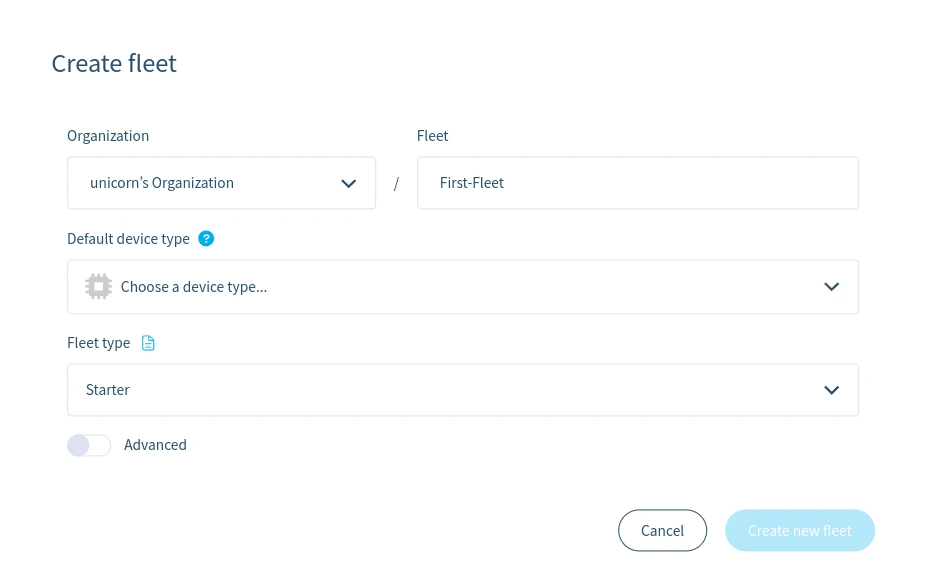
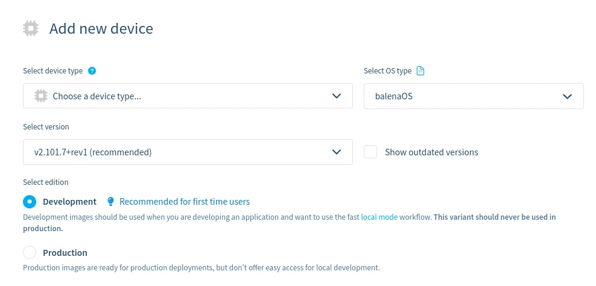
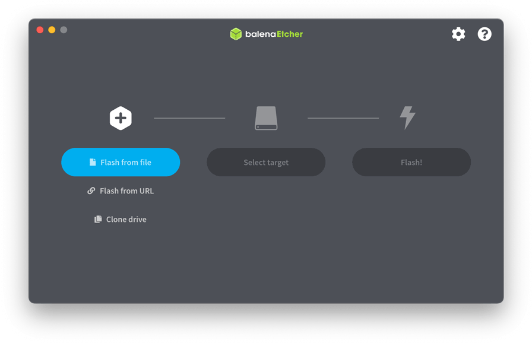
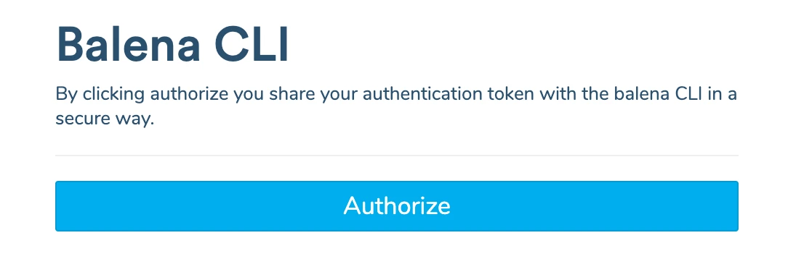
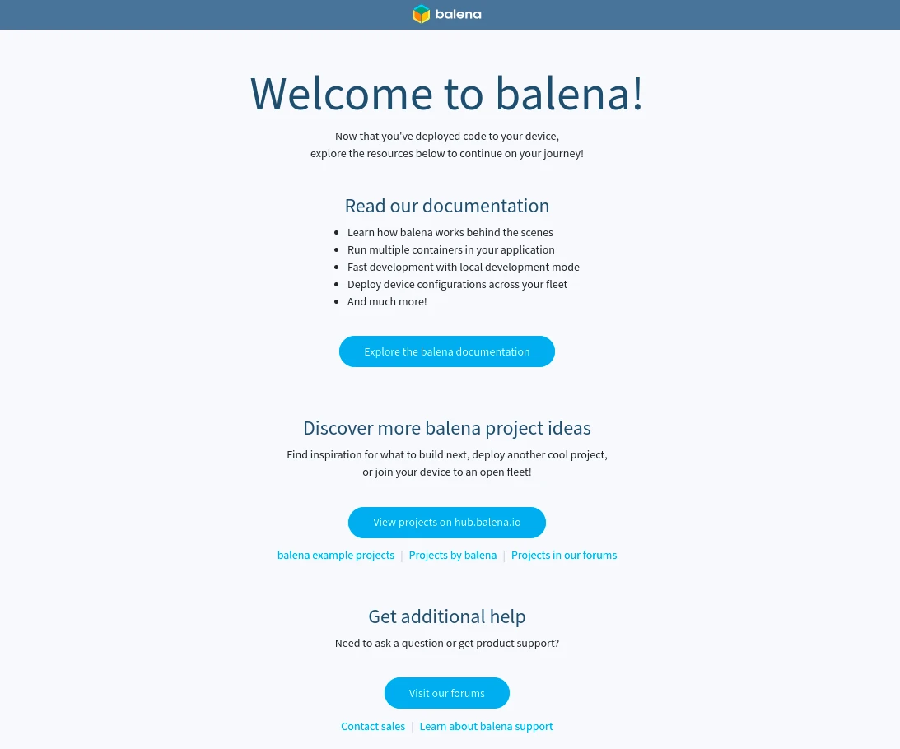
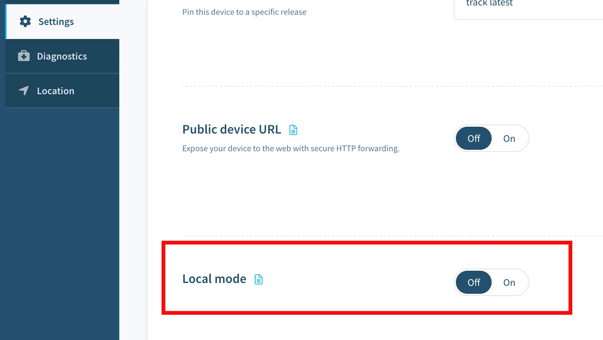
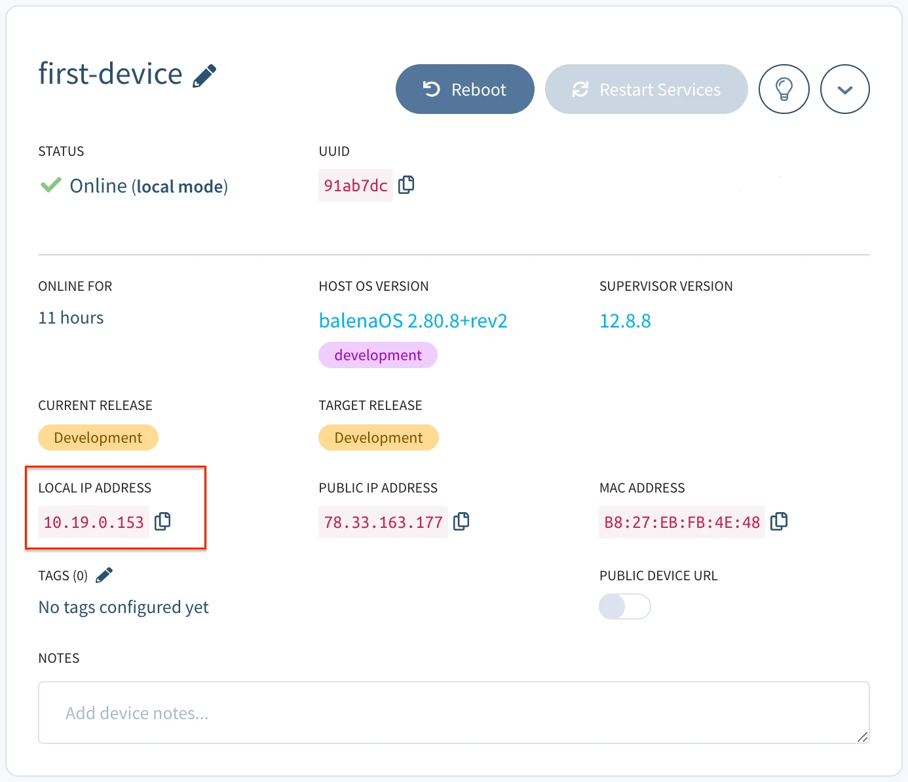

# Getting Started with Revolution Pi Connect S

In this guide, we will help you get started with balenaCloud by:

* Setting up your **Revolution Pi Connect S** device and bringing it online on the balenaCloud dashboard.
* Deploying a _hello world_ project on the device in your language of choice.
* Developing the sample project: making changes and testing them on the device in real-time.

Once you've completed this getting started guide to balena, you'll be equipped with the fundamentals needed to continue developing your application using balenaCloud and be on the path to deploying fleets of devices to production. If you are looking for definitions of certain terms, refer to the [glossary](../more/glossary.md).

## What you'll need


* Your Revolution Pi Connect S device you want to get started with. Check out all of our [supported devices](../../reference/hardware/devices.md).
* A tool to flash the new operating system on the device. We recommend [Etcher](https://www.balena.io/etcher).
* A way to connect the device to the internet, either through wifi (if available) or ethernet cable.
* A method of reliably powering the device.
* A [balenaCloud account](https://dashboard.balena-cloud.com/signup). BalenaCloud is free for up to 10 devices and requires no payment method to sign up.
* Install [balena CLI](https://github.com/balena-io/balena-cli/blob/master/INSTALL.md) to develop & manage your device on balenaCloud. 

## Create a fleet

A fleet is a group of devices that share the same [architecture](../../reference/hardware/devices.md) and run the same code. Devices are added to fleets and can be moved between fleets at any time.

To create your first fleet, log into your [balenaCloud dashboard](https://dashboard.balena-cloud.com/) and click the **Create fleet** button.

<figure><figcaption></figcaption></figure>

Enter a fleet name, select the **Revolution Pi Connect S** device type, choose the _Starter_ [fleet type](../accounts/fleet-types.md), and click **Create new fleet**:

<figure><figcaption></figcaption></figure>

You'll then be redirected to the summary of the newly created fleet, where you can add your first Revolution Pi Connect S.

## Add a device and download OS

<figure><figcaption></figcaption></figure>

balenaCloud builds a custom balenaOS image configured for Revolution Pi Connect S which allows the device to provision and join the new fleet you created automatically. Start by clicking **Add device** on the fleet summary. Your device type will be preselected here since you already chose it when creating the fleet. Other device types of the same [architecture](../../reference/hardware/devices.md) can also be picked to join the fleet.

<figure><figcaption></figcaption></figure>

Select an OS type of _balenaOS_, and you will see a list of available balenaOS versions with the latest preselected. Choose a **Development** version of the OS. The production OS does not facilitate the development workflow we'll be using. Find out more about the [differences between Development and Production images](../../reference/os/overview.md#development-vs-production-images).

<figure><figcaption></figcaption></figure>

Select the type of network connection you'll be using: _Ethernet Only_ or _Wifi + Ethernet_. A network connection is required to allow the device to connect to balenaCloud. Selecting _Wifi + Ethernet_ allows you to enter a _Wifi SSID_ and _Wifi Passphrase_ which is then built into the image.

<figure><figcaption></figcaption></figure>

Finally, click the **Download balenaOS** button. When the download completes, you should have a zipped image file with a name like `balena-First-Fleet-revpi-connect-s-6.10.24-v17.4.2.img.zip`.

## Provision device

Next, we will flash the downloaded image onto the device. To do so, follow the following steps:

  * While not having the Revolution Pi Connect S board powered, connect your system to the board's USB port via a micro-USB cable. Power on the Revolution Pi Connect S.
  * Write the balenaOS file you downloaded to the Revolution Pi Connect S. We recommend using [Etcher](https://etcher.balena.io/).
  


  * Wait for writing of balenaOS to complete.
  * Power off the Revolution Pi Connect S and unplug the micro-USB cable
  * Remove and re-connect power to the Revolution Pi Connect S to boot the device.

When complete, after a minute or two the device should appear on your balenaCloud [dashboard](https://dashboard.balena-cloud.com/), and you should now be ready to deploy some code. If you are not able get the device to appear on the dashboard, then check out our [troubleshooting guide for Revolution Pi Connect S](/faq/troubleshooting/revpi-connect-s) or try our [support channels](../accounts/support-access.md).

## Install the balena CLI

Now that you have an `operational` device in your fleet, it's time to deploy some code. We will use the balena CLI for this. Follow the instructions below to install balenaCLI for the operating system available on your system. Skip the next part if you have balena CLI already installed.



1. [Download the CLI installer](https://github.com/balena-io/balena-cli/releases/download/v24.0.2/balena-cli-v24.0.2-macOS-x64-installer.pkg).
2. Double click the downloaded file to run the installer and follow the installer's instructions.
3. To run balena CLI commands, open the Terminal app ([Terminal User guide](https://support.apple.com/en-gb/guide/terminal/apd5265185d-f365-44cb-8b09-71a064a42125/mac)).



1. [Download the CLI installer](https://github.com/balena-io/balena-cli/releases/download/v24.0.2/balena-cli-v24.0.2-windows-x64-installer.exe).
2. Double click the downloaded file to run the installer and follow the installer's instructions.
3. To run balena CLI commands, open a command prompt: Click on the Windows Start Menu, type PowerShell, and then click on Windows PowerShell.



1. [Download the standalone CLI](https://github.com/balena-io/balena-cli/releases/download/v24.0.2/balena-cli-v24.0.2-linux-x64-standalone.tar.gz).
2. Extract the contents of the tar.gz file to any folder you choose, for example `/home/james`. The extracted contents will include a `balena/bin` folder.
3. Add that folder (e.g. `/home/james/balena/bin`) to the PATH environment variable. Check this [StackOverflow](https://stackoverflow.com/questions/14637979/how-to-permanently-set-path-on-linux-unix) post for instructions. Close and re-open the terminal window so that the changes to PATH can take effect.



After balena CLI is installed, login to your balena account using the `balena login` command on the terminal:

```shell
$ balena login
 _            _
| |__   __ _ | |  ____  _ __    __ _
| '_ \ / _` || | / __ \| '_ \  / _` |
| |_) | (_) || ||  ___/| | | || (_) |
|_.__/ \__,_||_| \____/|_| |_| \__,_|


Logging in to cloud.com
? How would you like to login? (Use arrow keys)
❯ Web authorization (recommended)
  Credentials
  Authentication token
  I don't have a balena account!
```

You will be asked to choose an authentication method, choose _Web authorization_ which will bring up a web browser window that allows you to login to your balenaCloud account. Click the **Authorize** button, and head back to the terminal after the login successful message appears.

<figure><figcaption></figcaption></figure>

## Create a release

After login, test the balena CLI by running the `balena fleet list` command, which should return information about the fleet you created in the previous step. Take a note of the fleet `NAME` as you'll need this in the next step to push the code to your device(s) in that fleet.

```shell
$ balena fleets
ID    NAME         SLUG                                 DEVICE TYPE           DEVICE COUNT   ONLINE DEVICES
98264 First-Fleet  balena CLI/first-fleet    Revolution Pi Connect S    0              0
```



A nice project to try is the [balena-nodejs-hello-world](https://github.com/balena-io-examples/balena-nodejs-hello-world) project. It's a Node.js web server that serves a static page on port 80. To get started, [download the project](https://github.com/balena-io-examples/balena-nodejs-hello-world/archive/master.zip) as a zipped file from GitHub, unzip it and open a terminal in the root of the extracted project directory.


A nice project to try is the [balena-python-hello-world](https://github.com/balena-io-examples/balena-python-hello-world) project. It's a Python web server that serves a static page on port 80. To get started, [download the project](https://github.com/balena-io-examples/balena-python-hello-world/archive/master.zip) as a zipped file from GitHub, unzip it and open a terminal in the root of the extracted project directory.


A nice project to try is the [balena-cpp-hello-world](https://github.com/balena-io-examples/balena-cpp-hello-world) project. It's a C++ web server that serves a static page on port 80. To get started, [download the project](https://github.com/balena-io-examples/balena-cpp-hello-world/archive/master.zip) as a zipped file from GitHub, unzip it and open a terminal in the root of the extracted project directory.


A nice project to try is the [balena-rust-hello-world](https://github.com/balena-io-examples/balena-rust-hello-world) project. It's a Rust web server that serves a static page on port 80. To get started, [download the project](https://github.com/balena-io-examples/balena-rust-hello-world/archive/master.zip) as a zipped file from GitHub, unzip it and open a terminal in the root of the extracted project directory.


A nice project to try is the [balena-go-hello-world](https://github.com/balena-io-examples/balena-go-hello-world) project. It's a Go web server that serves a static page on port 80. To get started, [download the project](https://github.com/balena-io-examples/balena-go-hello-world/archive/master.zip) as a zipped file from GitHub, unzip it and open a terminal in the root of the extracted project directory.



To create a release, use the `balena push First-Fleet` command replacing `First-Fleet` with the name of your fleet. Ensure you are working from the root of the extracted project directory.

```shell
$ balena push First-Fleet
```

This command pushes the code to the balena builders, where it will be compiled, built, turned into a release, and applied to every device in the fleet.

You'll know your code has been successfully compiled and built when our friendly unicorn mascot appears in your terminal:

```shell
[hello-world]  Successfully built 51bd190f7530
[Info]       Generating image deltas from release 8acfdc579f7cb0fe424d1b800588b6f5 (id: 2186018)
[Success]    Successfully generated image deltas
[Info]       Uploading images
[Success]    Successfully uploaded images
[Info]       Built on builder05
[Success]    Release successfully created!
[Info]       Release: c0c593803588a304c173124827d96b99 (id: 2186339)
[Info]       ┌────────────────────┬────────────┬────────────┐
[Info]       │ Service            │ Image Size │ Build Time │
[Info]       ├────────────────────┼────────────┼────────────┤
[Info]       │ hello-world        │ 190.04 MB  │ 50 seconds │
[Info]       └────────────────────┴────────────┴────────────┘
[Info]       Build finished in 1 minutes, 4 seconds
                            \
                             \
                              \\
                               \\
                                >\/7
                            _.-(6'  \
                           (=___._/` \
                                )  \ |
                               /   / |
                              /    > /
                             j    < _\
                         _.-' :      ``.
                         \ r=._\        `.
                        <`\\_  \         .`-.
                         \ r-7  `-. ._  ' .  `\
                          \`,      `-.`7  7)   )
                           \/         \|  \'  / `-._
                                      ||    .'
                                       \\  (
                                        >\  >
                                    ,.-' >.'
                                   <.'_.''
                                     <'
```

The release will then be downloaded and started by all the devices in the fleet. You can see the progress of the device code updates on the device dashboard:

<figure><figcaption></figcaption></figure>

After the download, you should now have a web server running on your device and see some logs on your dashboard.

To give your device a public URL, click the _Public Device URL_ toggle on the device dashboard. Public device URL allow you to serve content from the device to the world easily without configuration as long as the server is running on port 80.

<figure><figcaption></figcaption></figure>

Follow the URL to view the welcome page with additional resources. Alternatively, you can point your browser to your device's local IP address to access the server running on your device. You can find the device's IP address on the device dashboard page. This is what you should be seeing.

<figure><figcaption></figcaption></figure>

## Developing your project

Now, let's try making some changes to this project and testing them right on the device. The project can be modified and pushed again using the same method as above, but since we are using a development version of the OS, we can enable _Local mode_ and push directly to the device for a faster development cycle.

Activate local mode on the device via the dashboard.

<figure><figcaption></figcaption></figure>

Once enabled, you can now use `balena push` again, but this time we will push directly to the local IP address of the device obtained via the dashboard.

<figure><figcaption></figcaption></figure>

```shell
$ balena push 10.19.0.153
```

The same build process as before is carried out, but this time instead of using the balena builders, the build takes place locally on the device itself.

```shell
[Info]    Streaming device logs...
[Live]    Watching for file changes...
[Live]    Waiting for device state to settle...
[Logs]    [8/26/2021, 11:58:18 AM] Creating network 'default'
[Logs]    [8/26/2021, 11:58:19 AM] Installing service 'hello-world sha256:...'
[Logs]    [8/26/2021, 11:58:20 AM] Installed service 'hello-world sha256:...'
[Logs]    [8/26/2021, 11:58:20 AM] Starting service 'hello-world sha256:...'
[Logs]    [8/26/2021, 11:58:23 AM] Started service 'hello-world sha256:...'
[Logs]    [8/26/2021, 11:58:24 AM] [hello-world] Starting server on port 80
[Live]    Device state settled
```

The balena CLI will now watch for changes to all the files within the project, and automatically push changes to the device when detected. Let's try making a change to title of our balena welcome page. Navigate to the `index.html` file present in the `static` directory of the project. Open the file and change the title from `Welcome to balena!` to `Hello balena!` and save the file. After saving the changes, you can observe balena CLI automatically start rebuilding only the parts of the Dockerfile that has been changed.

```shell
[Live]    Detected changes for container hello-world, updating...

...
[Live]    [hello-world] Restarting service...
[Logs]    [8/26/2021, 11:59:01 AM, 2:42:32 AM] Service exited 'hello-world sha256:...'
[Logs]    [8/26/2021, 11:59:04 AM, 2:42:35 AM] Restarting service 'hello-world sha256:...'
[Logs]    [8/26/2021, 11:59:05 AM, 2:42:36 AM] [hello-world] Starting server on port 80
```

When the rebuild is complete, take a look at the public device URL again to see your changes. The welcome page should have been updated with the new title.

<figure><figcaption></figcaption></figure>

## Next steps

Once you've finished making your changes, disable local mode and the device will revert back to running the latest release that's on your fleet. To update your fleet with the latest changes you've just worked on, use `balena push <fleet name>` once more to create a new release with those changes.

When it's finished building the device(s) will update as before. Remember anything pushed to the fleet in this way can be applied to 10+ or 1000+ devices with no extra effort! To continue learning, explore parts of the guide in more detail:

* Learn more about [local mode](../develop/local-mode.md), which allows you to build and sync code to your device locally for rapid development.
* Develop an application with [multiple containers](../develop/multicontainer.md) to provide a more modular approach to fleet management.
* Manage your device fleet with the use of [configuration](../manage/configuration.md), [environment](../manage/variables.md), and [service variables](../manage/variables.md).
* Find out more about the [balena CLI](../../reference/balena-cli.md) and the functionality it offers.
* Visit our blog to find step-by-step tutorials for some [classic balena projects](https://blog.balena.io/tags/project).
* To publish what you will build or have already built, head over to [balenaHub](https://hub.balena.io/).
* If you find yourself stuck or confused, help is just a [click away](https://www.balena.io/support).

**Enjoy balenafying all the things!**
