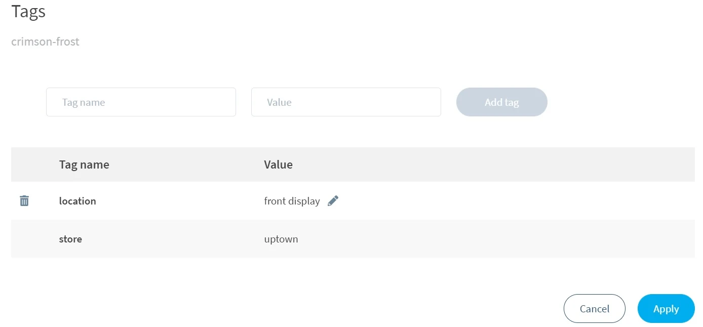

# Filters and tags

## Device filters

As the number of devices in your fleet grows, the device list will become increasingly busy. Filters provide a convenient way to quickly find specific devices based on shared characteristics.

### Add and update filters

To add a filter, click the _Add filter_ button near the top-left corner of your fleet page. You'll be presented with a window to configure your filter:

<figure><figcaption></figcaption></figure>

The first dropdown lists the device characteristics you can filter on. These characteristics correspond to the columns in your device list. The second dropdown contains comparison operators appropriate to the device characteristic, such as `is`, `is before`, `contains`, and `matches RegEx`. The third field is where you specify a value to filter on.


When filtering by [device tags](filters-tags.md#device-tags), you can filter by name, value, or both.


Click _Add filter_ to apply your configuration.

When your filter has been added, you will see it in a box above the device list. The device list will now only show devices that match your filter:

<figure><figcaption></figcaption></figure>

If you need to update your filter, simply click it and a new configuration window will appear. To remove, click the `x` to the filter's right. You can add any number of additional filters with the _Add filter_ button.

### Create a view

When you create a view, you are saving a specific set of filters that you may want to use again. To do this, click _Save view_ on the right side of the filter box:

<figure><figcaption></figcaption></figure>

You will be asked to choose a name for the saved view. This view can then be selected at any time by clicking the _Views_ button above the filter box.

## Device tags

Tags provide an easy way to include more information about your devices than what is already provided in the dashboard. With tags, you have the option to create key:value pairs that extend the available metadata for your devices. A device can be given multiple tags, and the tags can be used when you create [filters](filters-tags.md#device-filters).

### Create and edit tags

To add a tag from the device list, click the checkbox to the left of the devices you wish to tag, followed by the _Tags_ button on the right side of the dashboard:

<figure><figcaption></figcaption></figure>

You can also manage tags from a device's summary page. The _Manage Tags_ option is available in the action dropdown to the right of the _Reboot_ and _Restart_ buttons:

<figure><figcaption></figcaption></figure>

Both of these options will open the tag management window, from which you can define a name for your tag. Note that tag names cannot be empty, cannot contain spaces, and cannot use the reserved `io.balena` prefix. In addition to a name, you can define a value, although this is optional.


A device cannot have more than one tag with the same name, even if the values are different. If you create a new tag with the same name as an existing tag, the existing tag will be replaced.


This example shows how you could create a tag to keep track of device location:

<figure><figcaption></figcaption></figure>

Tags you add to your device will appear in a list in the management window. They can be edited or removed from here:

<figure><figcaption></figcaption></figure>

When you are finished creating and editing tags, click _Apply_ to keep the changes.


Device tags can also be created and managed programmatically [via the API](https://github.com/balena-io-playground/device-tags).


### Tag columns

Once tags have been added to at least one device, a new _All Tags_ column will appear on the right side of the device table:

<figure><figcaption></figcaption></figure>

This column can be hidden by clicking the arrow on the far right of the device table header. You can also add columns for specific tags by selecting _Add Tag Column_:

<figure><figcaption></figcaption></figure>

A new column will be created. You can then select which tag it should display:

<figure><figcaption></figcaption></figure>
