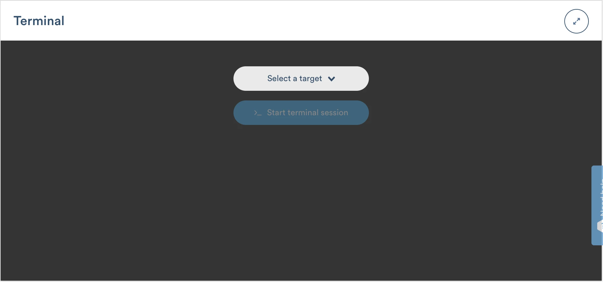
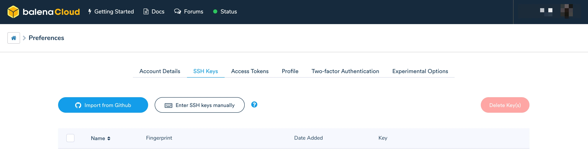

# SSH access

To help you debug, develop, and work with your fleets, we've provided a browser-based terminal and a command line tool for easy SSH access to your devices. With these tools, you have console access to any of your running containers, as well as to the host OS, letting you test out small snippets of code and check system logs on your device. You can also access your device via a standalone SSH client.


Host OS SSH access is available for devices running balenaOS version 2.7.5 and above.


SSH access is built on [Cloudlink](../welcome/security.md#cloudlink) and it not designed for high availability. It is not intended for use in the critical path of your application - you should not depend on it for continuous use as part of your own application.

### Using the dashboard web terminal

To use this feature, navigate to your fleet and select the device you want to access. You will see a _Terminal_ window below the _Logs_ window:

<figure><figcaption></figcaption></figure>

If your device is online, select a target as either the host OS or a running service, and click the blue _>\_ Start Terminal session_ button. In order to start a terminal session for a service, you need to ensure that the service container is running. If the container code crashes or ends quickly, it is not possible to attach a console to it.

A terminal session should be initiated for you in a second or two. If you would like a bigger window for the terminal, you can click the _Expand_ button in the upper-right corner.


To copy and paste in the terminal window, you cannot use the normal Ctrl + C and Ctrl + V shortcuts. You can either select Copy and Paste from a menu, or use Ctrl + Insert for copy and Shift + Insert for Paste. For MacOS users, ⌘ + C and ⌘ + V work as expected.


### Using `balena device ssh` from the CLI

To use the CLI, first [install it](https://github.com/balena-io/balena-cli/blob/master/INSTALL.md) and [add an SSH key to balenaCloud](ssh-access.md#add-an-ssh-key-to-balenacloud). Then run the following command on your development machine's terminal:

```shell
$ balena device ssh <device-uuid>
```

`<device-uuid>` is the unique identifier for the device you want to access, which can be found via the dashboard or in the output of the `balena device list` CLI command. By default, SSH access is routed into the host OS shell. However, you can SSH into a service by specifying its name as part of the command:

```shell
$ balena device ssh <device-uuid> main
```

This also works in multicontainer fleets; simply pass the name of the appropriate service (as defined in docker-compose.yml) instead of `main`.


To run a command in a non-interactive way, you can pipe commands to the CLI's stdin. For example, `echo "uptime; exit;" | balena device ssh <device-uuid>`.


When a fleet name or device UUID is used as above, `balena` ssh uses Cloudlink to create a secure tunnel to the device and then forward SSH traffic between the device and your development machine.

If an IP address or a .local hostname is used (instead of a fleet name or device UUID), `balena` ssh establishes a direct connection that does not rely on Cloudlink:

```shell
$ balena device ssh 192.168.1.23
$ balena device ssh <device-uuid>.local
```

When used with a [production variant of balenaOS](../../reference/OS/overview.md#development-vs.-production-mode), this feature requires balena CLI v13.3.0 or later, and balenaOS v2.44.0 or later. Otherwise, an SSH key must be added to the device's `config.json` file, [sshKeys section](../../reference/OS/configuration.md). These restrictions do not apply to [development variants of balenaOS](../../reference/OS/overview.md#development-vs.-production-mode), which allow unauthenticated `root` access (and for this reason, should never be directly exposed to the public internet).

### Using a standalone SSH client

The SSH server of a balenaOS device (host OS) listens on TCP port `22222`, and access is also possible with a standalone ssh client:

```shell
$ ssh -p 22222 <username>@<device_ip_address>
```

When the username is `root`, [production variants of balenaOS](../../reference/OS/overview.md#development-vs.-production-mode) perform authentication against public SSH keys previously added to the device's `config.json` file, [sshKeys section](../../reference/OS/configuration.md). When the username matches a valid balenaCloud user account, authentication is also performed against that user's public SSH keys [stored in balenaCloud](ssh-access.md#add-an-ssh-key-to-balenacloud) (this feature requires balenaOS v2.44.0 or later). The username can be found in the profile or preferences section of the web dashboard, or with the balena whoami\` CLI command.

Development variants of balenaOS allow unauthenticated access and should never be directly exposed to the public internet.

The IP address will typically be a private IP address of a local network. For remote devices, see [balena device tunnel](ssh-access.md#balena-device-tunnel).

### balena device tunnel

The SSH server of a balenaOS device (host OS) listens on TCP port `22222`. This port is not blocked by any firewall on the device itself, but external firewalls or NAT routers will often block access at the network level. To get around this, you can use the `balena device tunnel` command of the balena CLI, which tunnels a TCP connection between a localhost port and a port on the device. For example, the following command maps local port `4321` to remote port `22222` on the device:

```shell
$ balena device tunnel <device-uuid> -p 22222:4321
```

The device can then be accessed on local port `4321` with a standalone SSH client:

```shell
$ ssh -p 4321 <username>@127.0.0.1
```

See note in the [previous section](ssh-access.md#using-a-standalone-ssh-client) regarding the username (`root` _vs._ balenaCloud user account).

### Add an SSH key to balenaCloud

To add an SSH key, go to the _Preferences_ page of balenaCloud and select the _SSH Keys_ tab.

<figure><figcaption></figcaption></figure>

You may either import an existing SSH key from GitHub or manually enter the public SSH key of an existing SSH key on your development machine.

If you do not have an existing key, you can follow [GitHub's documentation](https://help.github.com/en/github/authenticating-to-github/generating-a-new-ssh-key-and-adding-it-to-the-ssh-agent), skipping the step about adding the key to your GitHub account, and instead adding the key to your balenaCloud account.

### Troubleshooting with host OS access


For an in-depth guide to debugging balena devices see the device debugging masterclass.


Host OS SSH access gives you a handful of tools that can help you gather more information about potential issues on your device.


Making changes to running services and network configurations carries the risk of losing access to your device. Before making changes to the host OS of a remote device, it is best to test locally. Changes made to the host OS will not be maintained when the OS is updated, and some changes could break the updating process. When in doubt, [reach out](https://forums.balena.io/c/product-support) to us for guidance.


#### BalenaOS services

BalenaOS uses **systemd** as its init system, and as such, almost all the fundamental components in balenaOS run as systemd services. In general, some core services need to execute for a device to come online, connect to Cloudlink, download applications, and then run them:

* `chronyd.service` - Responsible for NTP duties and syncing 'real' network time to the device.
* `dnsmasq.service` - The local DNS service which is used for all host OS lookups.
* `NetworkManager.service` - The underlying Network Manager service, ensuring that configured connections are used for networking.
* `os-config.service` - Retrieves settings and configs from the API endpoint, including certificates, authorized keys, the cloudlink config, etc.
* `openvpn.service` - The VPN service itself, which connects to cloudlink, allowing a device to come online.
* `balena.service` - The [balenaEngine](https://www.balena.io/engine) service, the modified Docker daemon fork that allows the management and running of service images, containers, volumes, and networking.
* `balena-supervisor.service` - The balena Supervisor service, responsible for the management of releases, including downloading updates for and self-healing (via monitoring), variables (fleet/device), and exposure of these services to fleets via an API endpoint.
* `dbus.service` - The DBus daemon socket which can be used by containers by applying the _io.balena.features.dbus_ label, which exposes it in-container. This allows you to control several host OS features, including the Network Manager.

Additionally, there are a couple of utility services that, while not required for a barebones operation, are also useful:

* `ModemManager.service` - Deals with non-Ethernet or Wifi devices, such as LTE/GSM modems.
* `avahi-daemon.service` - Used to broadcast the device’s local hostname.

You may see all enabled services on the host OS with the following command:

```shell
$ systemctl list-unit-files | grep enabled
```

To check the status of a service, use the `systemctl status <serviceName>` command. The output includes whether the service is currently loaded and active, together with detail about the process, including the latest entries from the journal log. For example, to obtain the status of the OpenVPN service use the following command:

```shell
$ systemctl status openvpn.service
```

#### Checking logs

**journalctl**

Information from a variety of services can be found using the **journalctl** utility. The output from **journalctl** can be very large, and you can filter the output using the `--unit` (or the short version `-u`) option to only output logs from a single service.

A typical example of using **journalctl** might be following a service to see what’s occurring in real-time by using the `--follow` (`-f`) option. For example, to follow the latest supervisor logs on the device:

```shell
$ journalctl --follow --unit balena-supervisor
```

To limit the output to the last _x_ messages, use the `-n` option. The following example lists the last 10 messages from the `chronyd` service:

```shell
$ journalctl -n 10 -u chronyd
```

The `--all` (`-a`) option may be used to show all entries, even if long or with unprintable characters. This is especially useful for displaying the service container logs from applications when applied to `balena.service`.

```shell
$ journalctl --all -n 100 -u balena
```

**dmesg**

For displaying messages from the kernel, you can use **dmesg**. Similar to **journalctl**, the output from **dmesg** will be very large without additional options. The following example limits the output to the last 100 lines:

```shell
$ dmesg | tail -n 100
```

#### Monitor balenaEngine

beginning with version 2.9.0, balenaOS includes the lightweight container engine [**balenaEngine**](https://www.balena.io/engine) to manage **Docker** containers. If you think the supervisor or application container may be having problems, you’ll want to use `balena` for debugging.

From the host OS this command will show the status of all containers:

```shell
$ balena ps -a
```

You can also check the **journalctl** logs for messages related to the balenaEngine service:

```shell
$ journalctl --follow -n 100 -u balena
```


For devices with balenaOS versions earlier than 2.9.0, you can replace `balena` in these commands with `docker`.


#### Inspect network settings

**NetworkManager**

**NetworkManager** includes a [CLI](https://fedoraproject.org/wiki/Networking/CLI) that can be useful for debugging your ethernet and WiFi connections. The `nmcli` command, on its own, will show all interfaces and the connections they have. `nmcli c` provides a connection summary, showing all known connection files with the connected ones highlighted. `nmcli d` displays all network interfaces (devices).

Another useful place to look for **NetworkManager** information is in the **journalctl** logs:

```shell
$ journalctl -f -n 100 -u NetworkManager
```

**ModemManager**

Similar to **NetworkManager**, **ModemManager** includes a [CLI](https://www.freedesktop.org/software/ModemManager/man/1.8.0/mmcli.8.html), `mmcli`, to manage cellular connections. `mmcli -L` provides a list of available modems.

#### Look up version information

Knowing what version of a specific service is being run on your device can help you troubleshoot compatibility issues, known bugs, and supported features. Many services provide a direct option for displaying their version:

```shell
$ udevadm --version
$ systemctl --version
$ openssl version
```

#### Understand the file system

In some cases, you may need to examine the contents of certain directories or files directly. One location that is useful for troubleshooting purposes is the `/data` directory, which contains your device's Docker images, [persistent data](../develop/runtime.md#persistent-storage), and host OS update logs. The `boot` directory includes configuration files, such as [config.json](../../reference/OS/configuration.md), [config.txt](../../reference/OS/advanced.md) and [**NetworkManager** connections](../../reference/OS/network.md).

Note that the [filesystem layout](../../reference/OS/overview.md#stateless-and-read-only-rootfs) may look slightly different from what you’d expect—for example, the two locations mentioned above are found at `/mnt/data` and `/mnt/boot` respectively.
