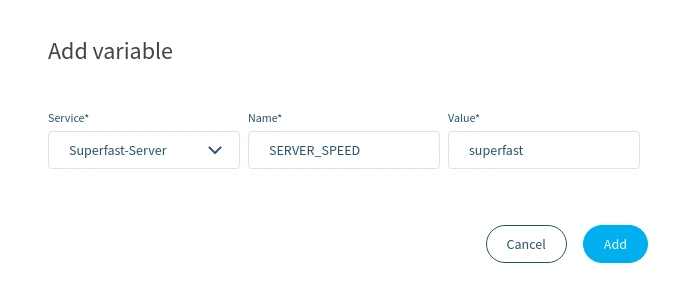

# Variables

Variables allow you to provide runtime configuration to one or more running services without having to modify your source code. Variables can be added onto the device using the balenaCloud dashboard and can be assigned to either a specific service or all services running on the device. You can use variables to store secrets and other sensitive values out of your codebase and configure them when needed from the dashboard.

Variables defined in the dashboard are exposed on the device as environment variables and can be accessed within the service or services that they were defined for as shown below:

<figure><figcaption></figcaption></figure>

Variables can be applied at the fleet or the individual device level through the Variables page. You can apply Variables to the entire fleet by navigating to the Variables page for that fleet. Adding or modifying a fleet variable for all services will restart all services on the device. Similarly, changing device variables defined only for a specific service will only restart the affected service.

Values defined for individual devices always override those defined for the fleet. Values defined for specific services would override variables defined at the same level (Fleet or device level). So for any given variable, the **device service specific variable** will always have the top priority, followed by the **device variable for all services**, then the **fleet service specific variable**, and finally the **fleet variable for all services**.


Any variables defined through the dashboard do not apply to devices in [local mode](../develop/local-mode.md).


Values can be up to 1MB (or approximately 1 million characters) in size each. A device will re-download the variables every time the state changes in the API, which may potentially result in a lot of [network traffic](configuration.md#variable-list). The interval can be configured with the [BALENA\_SUPERVISOR\_POLL\_INTERVAL configuration variable](../../reference/supervisor/bandwidth-reduction.md#side-effects-warnings).

## Fleet-wide variables

Variables defined at the fleet level are available to all devices in that fleet unless they are redefined with a variable of the same name at the device level.

Fleet-wide variables can be found from the Fleet Summary page by clicking the _Variables_ tab.

To define a new variable, click the _Add variable_ button in the upper-left corner.

<figure><figcaption></figcaption></figure>

In the dialog box that opens, select either 'All services' or a specific service to which the variable will be applied.

Define a name and value for your variable. Click the _Add_ button to apply the variable to all devices in your fleet that do not have their own values defined:

<figure><figcaption></figcaption></figure>

Your new variable will show up in the list, where it can easily be modified or removed. Adding or modifying fleet variables will trigger restart of all services on the device.

<figure><figcaption></figcaption></figure>


Deleting a fleet-level variable will not delete a device-level variable of the same name.


If you have already defined variables at the device level, they will appear below the fleet variables of the same type. You can easily apply a device value to the entire fleet by clicking _Define fleet-wide_:

<figure><figcaption></figcaption></figure>

## Device Variables

Device variables are applied to only one device. Device variables for a specific service override device variables for all services, and all device variables override fleet-wide variables.

Adding a device variable is very similar to adding a fleet variable. From the Device Summary page, select _Device Variables_ to open the variables page. Click _Add variable_ to select the appropriate service or all services if necessary. Add a name and a value for the variable you wish to apply, and click the _Add_ button to add the variable.

The variable list will include variables defined for that specific device, as well as any fleet variables of the same type:

<figure><figcaption></figcaption></figure>

You can override the value of a fleet variable by clicking _override_ in the far-right column. This will pop up the variable editing dialog, where you can change the value:

<figure><figcaption></figcaption></figure>

Changing a variable defined only for a specific service will only restart the affected service.

## Managing with the CLI & SDK

The balena CLI and SDKs all include methods to easily read, add or update variables. Consult the appropriate reference for code examples.

* [CLI environment reference](../../../external-docs/balena-cli/latest.md#env-list)
* [Node.js SDK environment reference](../../../reference/sdk/node-sdk/#balena.models.fleet.envVar)
* [Python SDK environment reference](../../../external-docs/sdk/python-sdk/latest.md)
