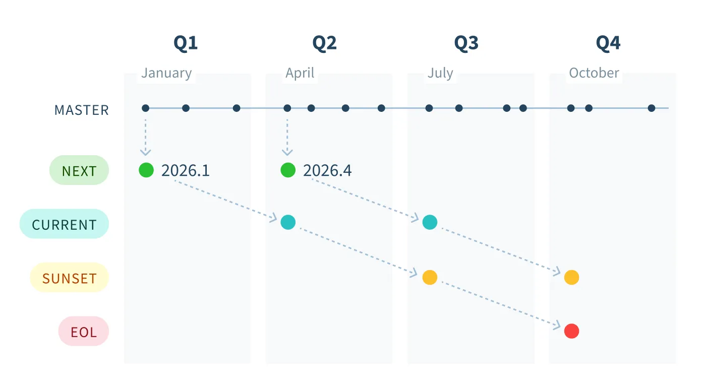
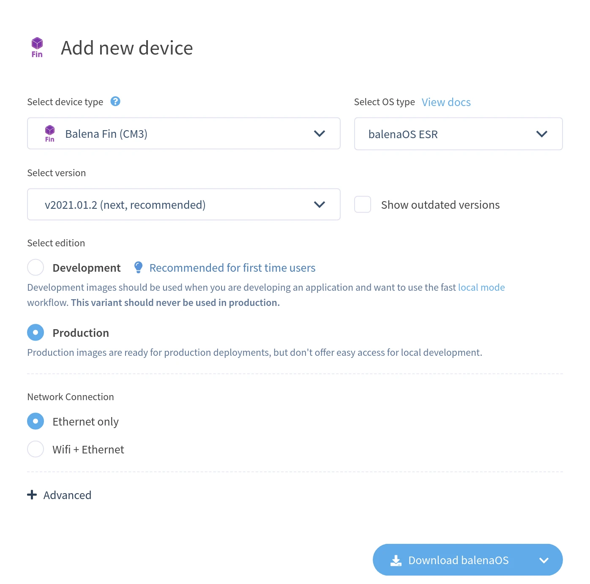

# Extended Support Release (ESR) process


This feature is only available on [Production and Enterprise plans](https://balena.io/pricing/).


The balenaOS Extended Support Release (ESR) process allows fleet owners to update to a new ESR version on their devices at most twice a year to ensure they are on a supported version. New ESR versions are released quarterly, which allows fleet owners to plan their update schedule.

Each ESR release is supported for nine months from the time of release. Support includes backports for high-risk security vulnerabilities and critical bug fixes, and are guaranteed not to break the interface. Backports of any functional enhancements are not in scope.

## ESR versions and schedule

ESR versions are named by year and month like `yyyy.m` and contain a patch version number starting at zero. So `2026.1.0` is the first release of the `2026.1` ESR version, and the first backport or fix during its supported lifetime is `2026.1.1`.

At any one time there are three supported lines of ESR versions, which we tag as _next_, _current_, and _sunset_ based on their age, as shown in the diagram below. Every three months a new ESR version is released, which advances the ESR version tagged for each line, for example `2026.1` to `2026.4` below. At the same time, the tag for a particular ESR version transitions downward toward eventual end of life (EOL).

<figure><figcaption></figcaption></figure>

Let's walk through an example. In January 2026, at the beginning of Q1, the master branch of balenaOS is released as ESR version `2026.1` and tagged as _next_ since it is the next ESR release. In three months a new ESR version, `2026.4`, is tagged as _next_, while the tag for `2026.1` transitions to _current_. Similarly, three months after that a new ESR version is released and `2026.1` is tagged as _sunset_. Finally in October, nine months after release, the `2026.1` ESR version is untagged, having reached its end of life. It will not receive further fixes. A user should perform a [self-service update](updates/self-service.md#running-an-update) to a newer supported ESR version by now for the ongoing benefits.

## Using an ESR host OS version

### Adding a new device

For new devices, if you are on a Production or Enterprise plan with a [supported device type](extended-support-release.md#supported-devices), when you add a new device, you will be given the option to _Select OS type_ which defaults to _balenaOS ESR_. If you would like a non-ESR version, expand this dropdown and select _balenaOS_ for the host OS type.

<figure><figcaption></figcaption></figure>

Next, select the ESR version as either _next_, _current_, or _sunset_ if available. The _next_ version is selected by default and offers at least six months (and up to nine months) of critical backports and fixes.

### Host OS update

For those users on a Production or Enterprise plan with an existing [supported device](extended-support-release.md#supported-devices), you can update to an ESR version via a [self-serve update](updates/self-service.md#running-an-update). You should select the _balenaOS ESR_ host OS type and your chosen ESR version.


Once updated to an ESR version, it is not possible to update from an ESR host OS version to a non-ESR one.


## Supported devices

All device types are eligible for ESR, however they require a dedicated build and release pipeline so support needs to be requested via our [support channels](https://balena.io/support).

ESR host OS versions are currently available for the following devices:


