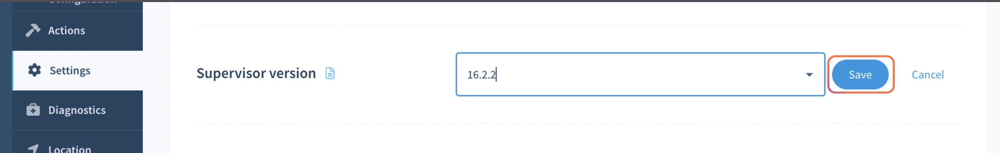

# Self-service Supervisor Upgrades

The balena Supervisor can be upgraded independently of balenaOS.

While the best long-term strategy is to consistently [upgrade the host OS](../os/updates/self-service.md), there are some cases whereby an independent Supervisor upgrade is preferable:

* Enable features in the Supervisor not yet available in an OS release
* No reboot
* Less downtime (if any)
* Smaller update size

To run an update for an individual device, navigate to that device's _Settings_ tab, scroll down to _Supervisor version_ section, and select the version of the balena Supervisor you would like to update to:

<figure><figcaption></figcaption></figure>

Updates can also be issued to multiple devices in the same fleet with the same CPU architecture. From the device list, click the checkbox to the left of any online devices you wish to update. Then use the _Modify_ dropdown to select the _Supervisor version_ option:

<figure><figcaption></figcaption></figure>

From the dialog box that opens, select the Supervisor version you would like to update to and click the `Apply` button to trigger the Supervisor update.

<figure><figcaption></figcaption></figure>

Additionally, these updates can be scheduled for an offline device as well. The update will be performed once the device comes back online and successfully connects to the balenaCloud backend.


Only devices running balenaOS v2.12.0 or greater are able to upgrade the Supervisor independently.


## Upgrade paths

Downgrades of the Supervisor are not supported.

Upgrading to a new minor version is supported, and should be seamless.

Upgrading to a new major version should work; however, it is the user's responsibility to test those changes, and verify that they do not cause problems for their fleet. The changelog for the balena Supervisor can be found [here](https://github.com/balena-os/balena-supervisor/blob/master/CHANGELOG.md).

For devices managed by balenaCloud, we reserve the right to upgrade the Supervisor when necessary, such as to apply bug fixes. (This does not apply to devices managed by balena On Prem installations, or by self-hosted openBalena instances.) We will make every effort to notify users in advance of such an update, and to respect constraints such as bandwidth. In addition, we will not upgrade between major versions without consulting with users.
